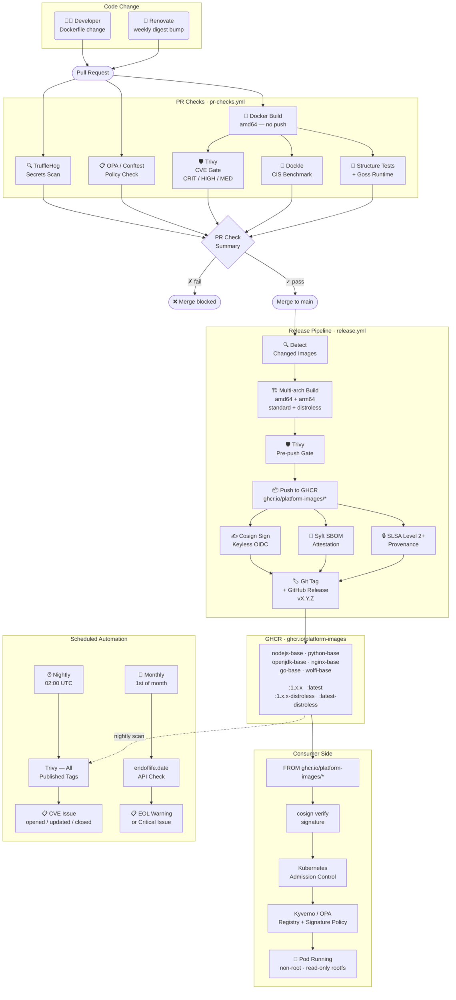

# base-docker-images

Hardened, CVE-free base Docker images built on [Wolfi](https://wolfi.dev) by [Chainguard](https://chainguard.dev).  
A platform engineering reference implementation: every image is digest-pinned, automatically patched, signed with Cosign, SBOM-attested, and SLSA Level 2+ provenance-stamped before it reaches a consumer.

[](https://github.com/platform-images/base-docker-images/actions/workflows/pr-checks.yml)
[](https://github.com/platform-images/base-docker-images/actions/workflows/release.yml)
[](https://github.com/platform-images/base-docker-images/actions/workflows/scheduled-scan.yml)
[](LICENSE)

---

## Architecture

The diagram below shows the complete supply chain — from a developer pushing a Dockerfile change or Renovate opening a digest-bump PR, through every automated gate, to a verified image running in Kubernetes.



---

## Images

| Image | Description | Standard | Distroless |
|---|---|:---:|:---:|
| `wolfi-base` | Minimal Wolfi OS — foundation for all other images | ✓ | — |
| `nodejs-base` | Node.js LTS runtime | ✓ | ✓ |
| `python-base` | Python 3.12 runtime | ✓ | ✓ |
| `openjdk-base` | OpenJDK + Maven (standard) · JRE-only (distroless) | ✓ | ✓ |
| `nginx-base` | Hardened Nginx — non-root, port 8080, security headers | ✓ | — |
| `go-base` | Go toolchain (standard) · Static base for compiled binaries (distroless) | ✓ | ✓ |

### Standard vs Distroless

| | Standard | Distroless |
|---|---|---|
| Shell | ✓ (`/bin/sh`) | ✗ |
| Package manager | ✓ (`apk`) | ✗ |
| Attack surface | Larger | Minimal |
| Intended use | Build stage, CI, debugging | Production runtime stage |

Use the **standard** variant for `FROM … AS builder` and the **distroless** variant for the final `FROM` in multi-stage builds:

```dockerfile
# Build stage — shell + package manager available
FROM ghcr.io/platform-images/nodejs-base:1.0.0 AS builder
WORKDIR /app
COPY package*.json ./
RUN npm ci --only=production

# Runtime stage — no shell, minimal attack surface
FROM ghcr.io/platform-images/nodejs-base:1.0.0-distroless
WORKDIR /app
COPY --from=builder /app/node_modules ./node_modules
COPY --from=builder /app/dist ./dist
CMD ["node", "dist/index.js"]
```

---

## Consumer Quick Start

### 1 — Verify the signature before pulling

```bash
cosign verify ghcr.io/platform-images/nodejs-base:1.0.0 \
  --certificate-identity=https://github.com/platform-images/base-docker-images/.github/workflows/release.yml@refs/heads/main \
  --certificate-oidc-issuer=https://token.actions.githubusercontent.com
```

### 2 — Pull pinned to digest (recommended for production)

```dockerfile
FROM ghcr.io/platform-images/nodejs-base:1.0.0@sha256:<digest>
```

### 3 — Inspect the SBOM

```bash
cosign download attestation ghcr.io/platform-images/nodejs-base:1.0.0 \
  | jq -r '.payload' | base64 -d | jq .
```

### 4 — Apply admission control policies (Kubernetes)

```bash
# Enforce approved registry only
kubectl apply -f policies/admission/kyverno-registry-policy.yaml

# Require valid Cosign signature before pod admission
kubectl apply -f policies/admission/kyverno-cosign-policy.yaml
```

---

## Security Model

| Control | Implementation |
|---|---|
| Zero critical/high/medium CVEs | Trivy gate blocks merge and pre-push on every build |
| Non-root by default | Every image sets `USER nonroot` (uid 65532) or `USER 101` (nginx) |
| No shell in production images | Distroless variants have no `/bin/sh` — validated by structure tests |
| Digest-pinned base images | All `FROM` lines pin `@sha256:…` — Renovate bumps weekly |
| Supply chain signing | Cosign keyless signing via GitHub Actions OIDC — verifiable without a key |
| SBOM attestation | Syft generates SPDX JSON attached as OCI attestation to every image |
| SLSA Level 2+ provenance | `actions/attest-build-provenance` proves build origin and environment |
| Secrets never baked in | TruffleHog scans every PR diff for verified secrets |
| Policy enforcement | OPA/Conftest validates every `Dockerfile*` against `policies/dockerfile.rego` |
| CIS benchmark | Dockle report saved as workflow artifact on every release |
| Admission control | Kyverno and OPA Gatekeeper policies enforce registry + signature at pod admission |
| Runtime EOL tracking | Monthly check against endoflife.date API — issues opened 90 days before and on EOL |

---

## CI/CD Pipeline

### Trigger 1 — Pull Request (`pr-checks.yml`)

Runs on every PR to `main`. All jobs must pass for merge to be allowed.

```
PR opened / updated
  → TruffleHog secrets scan          (blocks if verified secrets found)
  → OPA/Conftest policy check        (blocks if Dockerfile violates policy)
  → Docker build (amd64, no push)    (changed images only — matrix strategy)
      → Trivy CVE scan               (blocks if CRIT/HIGH/MED CVEs)
      → Dockle CIS lint              (blocks on CIS violations)
      → container-structure-test     (validates user, binaries, labels)
      → Goss runtime tests           (validates running container state)
  → PR Check Summary                 (single required status check)
```

### Trigger 2 — Merge to Main (`release.yml`)

Runs after every merge. Only rebuilds images whose directories changed.

```
Merge to main
  → Detect changed image directories
  → Per changed image:
      → Calculate next semver from git tags
      → Build amd64 locally → Trivy pre-push gate
      → Build + push multi-arch (amd64 + arm64) to GHCR
      → Build + push distroless variant (if exists)
      → Dockle CIS report → saved as workflow artifact
      → Syft SBOM → attached as OCI attestation
      → SLSA Level 2+ provenance attestation
      → Cosign keyless sign
      → Create git tag release/<image>/vX.Y.Z
      → Create GitHub Release with pull instructions
```

### Trigger 3 — Renovate Digest Bump (`renovate-automerge.yml`)

Renovate opens weekly PRs bumping `@sha256:` pins. This workflow validates the PR only touches Dockerfiles and `renovate.json`, then enables auto-merge — GitHub merges automatically once PR Checks pass.

### Trigger 4 — Nightly CVE Scan (`scheduled-scan.yml`)

02:00 UTC every night. Scans all published `:latest` tags in GHCR. Opens a labelled GitHub Issue per image if CVEs are found above threshold. Updates the existing issue on subsequent scans. Closes it automatically when a clean scan comes back.

### Trigger 5 — Runtime EOL Check (`eol-check.yml`)

1st of every month. Queries the [endoflife.date](https://endoflife.date) API for Node.js, Python, OpenJDK, Nginx, and Go. Opens a warning issue at 90 days before EOL and a critical issue once the runtime has passed its EOL date.

---

## Local Development

```bash
# Build and test a single image locally
make build IMAGE=nodejs-base
make scan  IMAGE=nodejs-base     # Trivy CVE scan
make test  IMAGE=nodejs-base     # structure-test + goss
make lint  IMAGE=nodejs-base     # Dockle + OPA/Conftest
make all   IMAGE=nodejs-base     # build + scan + test + lint

# Build distroless variant
make build-distroless IMAGE=nodejs-base

# Spin up any image interactively for manual inspection
docker compose run --rm nodejs-base node --version
```

---

## Versioning

| Bump | When |
|---|---|
| `X.Y.Z` patch | Digest/CVE update only — no behaviour change |
| `X.Y.0` minor | New package, new variant, non-breaking change |
| `X.0.0` major | Base OS change, runtime version upgrade, breaking change |

Tags follow the pattern `release/<image-name>/vX.Y.Z` in git and `ghcr.io/platform-images/<image>:X.Y.Z` in the registry.

---

## Toolchain

| Purpose | Tool |
|---|---|
| Base OS | [Wolfi](https://wolfi.dev) via [Chainguard](https://chainguard.dev) |
| CVE Scanning | [Trivy](https://github.com/aquasecurity/trivy) |
| Secrets Scanning | [TruffleHog](https://github.com/trufflesecurity/trufflehog) |
| SBOM Generation | [Syft](https://github.com/anchore/syft) |
| Image Signing | [Cosign](https://github.com/sigstore/cosign) (keyless) |
| SLSA Provenance | [actions/attest-build-provenance](https://github.com/actions/attest-build-provenance) |
| Image Testing | [container-structure-test](https://github.com/GoogleContainerTools/container-structure-test) + [Goss](https://github.com/goss-org/goss) |
| CIS Benchmark | [Dockle](https://github.com/goodwithtech/dockle) |
| Digest Bumping | [Renovate](https://github.com/renovatebot/renovate) |
| Policy Enforcement | [OPA / Conftest](https://www.conftest.dev) |
| Admission Control | [Kyverno](https://kyverno.io) / [OPA Gatekeeper](https://open-policy-agent.github.io/gatekeeper) |
| Registry | [GHCR](https://ghcr.io) |
| Multi-arch Builds | [Docker Buildx](https://docs.docker.com/buildx/working-with-buildx/) |
| EOL Tracking | [endoflife.date](https://endoflife.date) API |

---

## Contributing

1. Fork the repo and create a branch from `main`
2. Make changes to the relevant `images/<name>/Dockerfile`
3. Run `make all IMAGE=<name>` locally — all checks must pass
4. Open a PR — the full PR Checks pipeline runs automatically
5. Once `PR Check Summary` is green, request a review

To add a new image, follow the structure of an existing image directory and add it to the matrix in both `pr-checks.yml` and `release.yml`.

---

## License

[Apache 2.0](LICENSE)
